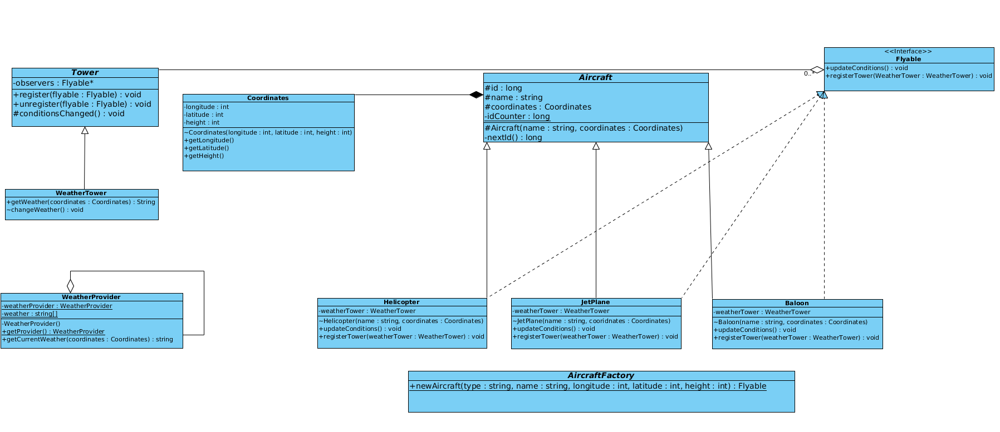

# Avaj Launcher

Implementation of a simple Java program according to a given class diagram written in UML.



- Сompiling and running the project
```
./launch.sh
```
- Сleaning the project
```
./clean.sh
```
